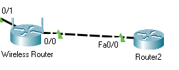
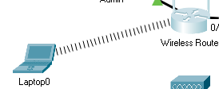

# Lucrul individual la RFF

Tema: *Configurarea și testarea unei rețele fără fir în packet tracer.*

Student: *Curmanschii Anton, MIA2022.*

## Obiectivele

1. Să se conecteze la un router fără fir;
2. Să configureze routerul fără fir;
2. Să conectezee un dispozitiv la routerul fără fir folosind un fir;
2. Să convecteze un dipozitiv fără fir la routerul fără fir;
2. Să adauge un punct de acces la rețea pentru a extinde aria de acoperire a rețelei;
2. Să actualizeze setările routerului.

## Relizarea topologiei

Topologia cu care se va petrece activitatea, routerele nu au fost conectate între sine sau configurate.

## 1. Să se conecteze la un router fără fir

> Pasul 1: conectez Admin-ul la routerul fără fir.

Folosesc cablu Eithernet straigh-through pentru a conecta Admin-ul la router.
Conectarea devine verde, înseamnă că am avut succes.

> Pasul 2: configurez Admin-ul să folosească DHCP.

Intru în **Admin -> Desktop -> IP Configuration** și bifez DHCP.

> Pasul 3: mă conectez la interfața web de configurare a routerului de pe Admin.

Pentru aceasta, intru în **Admin -> Desktop -> Web Brower** și introduc adresa routerului: *192.168.0.1*.
Routerul cere login și parola, care sunt ambele "admin" implicit.
Introduc "admin" în ambele câmpuri, și se încarcă meniul configurării.
https://youtu.be/JijrHF10EtE?t=20

Adresa care a primit-o Admin este *192.168.0.100*, ceea ce poate fi explicat dacă ne uităm mai jos până la Network Setup, care arată diapazonul adreselor DHCP, începând cu adresa lui Admin, prima adresă alocată pentru primul client, și conținând 49 adrese consecutive nealocate. 

> Pasul 4: modific configurarea routerulului.

Vom seta valori diferite pentru configurarea IP a routerului.
Vom folosi configurarea statică și un DNS, pe care îl vom configura mai târziu.

Scrolez jos și apas *Save Settings*.

Rămâne să configurăm celelălt router și serverul DNS.

Am conectat routerele între sine, și am configurat adresa interfeței din partea routerului doi.

Am conectat serverul, am adăugat adresa la a doua interfață de la al doilea router, am configurat adresa ip a serverului.

Am configurat serviciul DNS pe server, adaugând o înregistrare nouă: *www.stuff.com*, locată pe același server.

> Pasul 5: verificarea conexiunii.

Am dat câte un ping de la consola adminului la toate alte ip adresele, cu succes:
- Routerul fără fir: 209.165.200.225;
- Routerul 2: 209.165.200.226;
- Serverul DNS: 209.165.201.1;
- Serverul, prin DNS: www.stuff.com ([video](https://youtu.be/k6OKE2QWdzE))

Nu putem ajunge la Admin direct de pe Serverul DNS ([video](https://youtu.be/JijrHF10EtE?t=80)), deoarece, cred, routerul fără fir are un NAT configurat automat, datorită cui adresa locală nu este vizibilă pentru Routerul 2.
În plus, routerul 2 nu are configurat să trimită mesaje cu IP-uri necunoscute la Routerul fără fir.
De fapt, nici nu știe ce să facă cu ele și pur și simplu le pică.

Curios este faptul că routerul fără fir nu răspunde la pinguri de la server, cu toate că request-urile ajung la el.
Cred că pur și simplu este configurat implicit să nu răspundă la ele.

## 2. Să configureze routerul fără fir

Aici configurez setările WLAN al routerului fără fir.

> Pasul 1: configurarea lui SSID.

SSID înseamnă ca atare numele rețelei.
Am selectat regimul Mixed, adică că routerul suportă standardele 802.11 b, g și n simultan.
Nu avem regimele noi ac și ax în packet tracer.

> Pasul 2. configurarea securității.

Vom folosi protocolul WPA 2 Personal pentru securizarea accesului la rețea.
WPA 2 Personal doar cere parola pentru a putea conecta, pe când WPA 2 Enterprise folosește un server RADIUS.

## 3. Conectarea de clienți fără fir.

Am scos modulul de rețea existent din laptop pentru a adăuga modulul WPC300N, deoarece modulul existent era pentru cablu, iar se dorește a se conecta fără fir.
După ce am făcut acest lucru, am trecut la **Laptop0 -> Desktop -> PC Wireless -> Connect** și am dat refresh.

Putem accesa adresa *www.stuff.com* în browser sau cu un ping pentru a confirma că avem conexiune. [Video cu pinguri la server și la Admin](https://youtu.be/JijrHF10EtE?t=13).

## 4. Adăugarea unui punct de acces

Am conectat routerul la AP.

Configurez interfața punctului de acces, adaugând toate informațiile necesare despre rețea fără fir.

Acum mă conectez de pe Laptop2 la AP-ul (rețeaua cu semnalul mai slab), tot așa cum s-a descris anterior.

Verific conexiunea dând un ping la *www.stuff.com*.
Pingul reușește. [Video](https://youtu.be/JijrHF10EtE?t=142).

## 5. Actualizarea setărilor unui router

Ca să schimbăm parola de acces la router, accesăm *Administration -> Management* în GUI configurării și schimbăm **Router Password** la, de exemplu, *abcd1234*.

Se poate reconfigura spațiul adreselor al rețelei, de exemplu la 192.168.50.xxx de la 192.168.0.xxx.
Pentru asta se accesează meniul menționat anterior cu setările DHCP și ele se schimbă așa cum se dorește.
Însă, adresele clienților deja în folosire atunci nu vor mai lucra.
Ele trebuie să fie ori reactualizate manual folosind comanda `ipconfig /renew`, ori așteptând până când se sfârșește timpul de folosire (lease) al adresei.
Aceasta se întâmplă deoarece adresele nu mai sunt valide pentru spațiul de adrese specificat din nou.

## Concluzii

În această lucrare am demonstrat cum se configurează o rețea fără fir în Cisco Packet Tracer.
Am arătat cum să configurăm routerii fără fir și cum se realizează conectarea fără fir.
Am asociat un AP la router pentru a prelungi aria de acoperire a rețelei (nu de fapt am prelungit-o, dar ne putem imagina că stau departe).

## Bibliografie

Tutorialul de pe care s-au luat majoritatea task-urilor și a instrucțiunilor: https://itexamanswers.net/13-1-10-packet-tracer-configure-a-wireless-network-instructions-answer.html